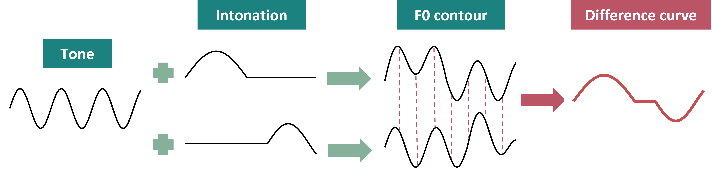

\

This website provides the accompany examples of paper 1119 at ICPhS special session: Prosody Visualisation Challenge.

Katrina Kechun Li, Francis Nolan, Brechtje Post. 'Disentagling Intonation in Tone Languages'. ICPhS 2023.

If you have any comments, feel free to contact Katrina Kechun Li at *kl502 at cam.ac.uk*.

> The question has often been raised as to how Chinese can have sentence intonation if words have definite tones. The best answer is to compare syllabic tone and sentence intonation with small ripples riding on large waves (though occasionally the ripples may be 'larger' than the waves). The actual result is an algebraic sum of the two kinds of waves.
>
>`r tufte::quote_footer('--- Yuen Ren Chao, 1968, *A grammar of spoken Chinese*, p.39')`

\

Taking inspiration from Chao's fascinating insights, we have developed a new approach to disentagle the complex nature of intonation in tone languages: The **difference curve**. 

By simply subtracting the f0 contour of the same sentence from another, we can potentially neutralize the tonal effects, allowing the true differences in intonation to emerge more clearly.

\

